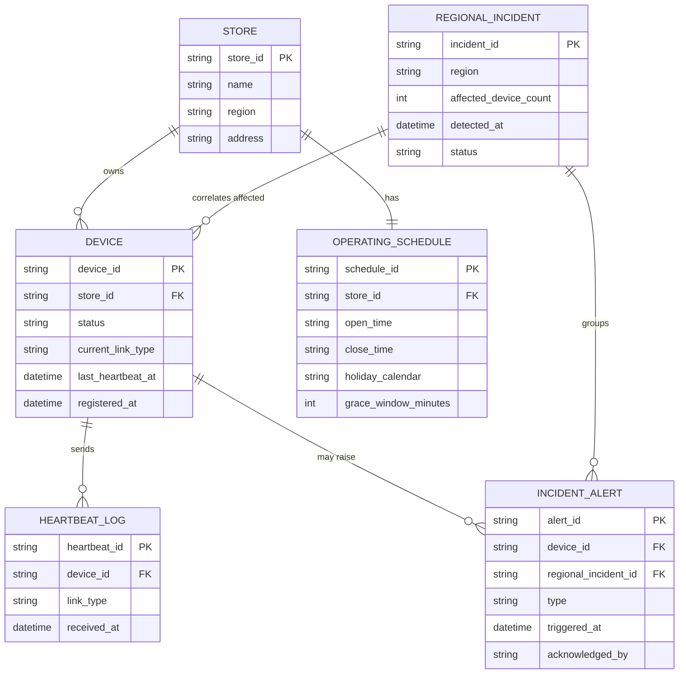

# ERD — Enhance (sau khi có health check theo lịch hoạt động)

Đây là **enhance**: ERD base cộng với các entity phục vụ đúng yêu cầu đề bài — lịch hoạt động riêng từng chi nhánh, ba trạng thái thiết bị thay vì nhị phân, grace window trước khi báo động, correlation sự cố mạng theo khu vực, và heartbeat thích ứng qua kênh dự phòng. So với base, `DEVICE.status` nay có 3 giá trị và `HEARTBEAT_LOG` biết phân biệt kênh kết nối (primary/backup).

