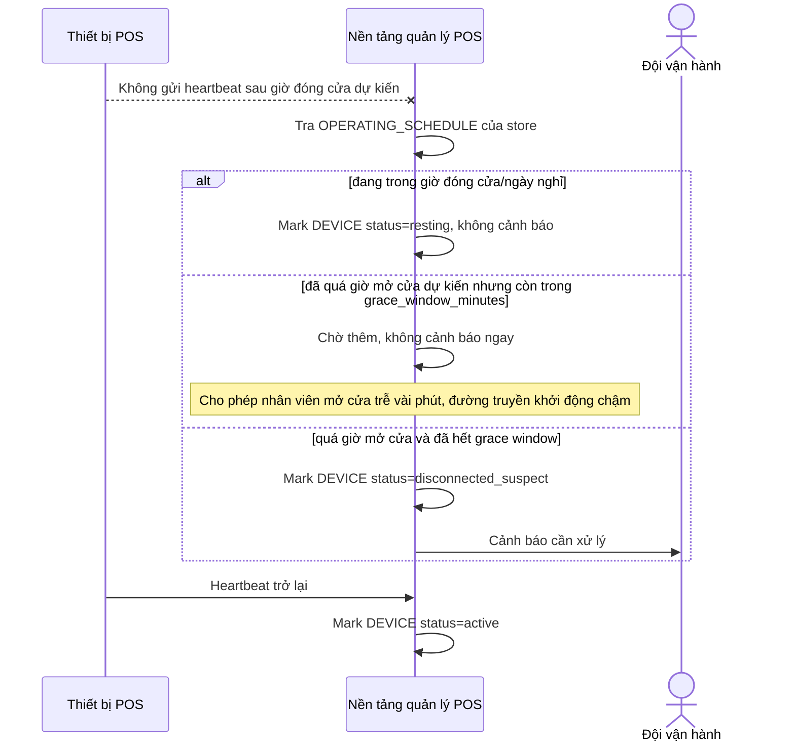

# Sequence Diagram — Enhance: Heartbeat Check

Đây là **enhance**, flow heartbeat check đã đổi hoàn toàn logic so với base: thay vì so với một timeout cố định, hệ thống so thời gian im lặng với `OPERATING_SCHEDULE` riêng của từng chi nhánh, áp dụng grace window, và phân biệt rõ ba trạng thái (đang hoạt động, đang nghỉ theo giờ đóng cửa, mất kết nối bất thường) thay vì chỉ online/offline.

