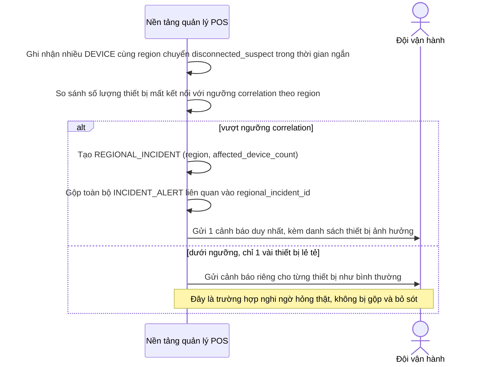

# Sequence Diagram — Enhance: Detect Regional Outage

Đây là **enhance**, flow hoàn toàn mới xử lý trường hợp hàng loạt thiết bị cùng khu vực mất kết nối đồng thời — gộp thành một `REGIONAL_INCIDENT` duy nhất thay vì tạo hàng trăm cảnh báo riêng lẻ, đồng thời vẫn phải tách được cảnh báo thật (1 chi nhánh hỏng máy thật giữa lúc có sự cố diện rộng).

