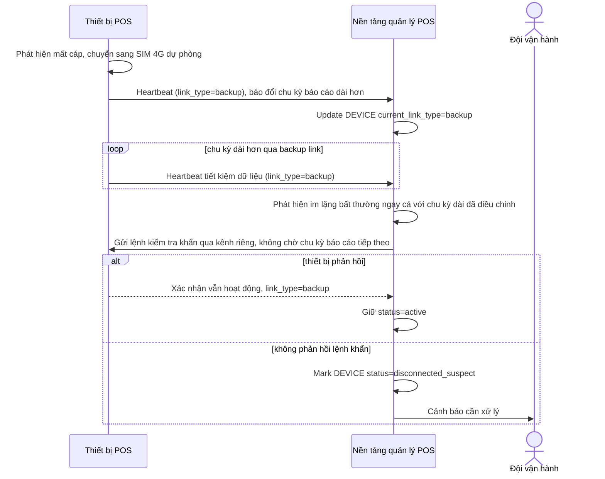

# Sequence Diagram — Enhance: Adaptive Heartbeat Over Backup Link

Đây là **enhance**, flow hoàn toàn mới cho thiết bị đang chạy trên đường truyền dự phòng (SIM 4G giới hạn dung lượng) — báo cáo trạng thái theo chu kỳ dài hơn để tiết kiệm dữ liệu, kèm cơ chế nền tảng chủ động gửi lệnh kiểm tra khẩn qua kênh riêng khi nghi ngờ sự cố, thay vì chờ chu kỳ báo cáo tiếp theo.

