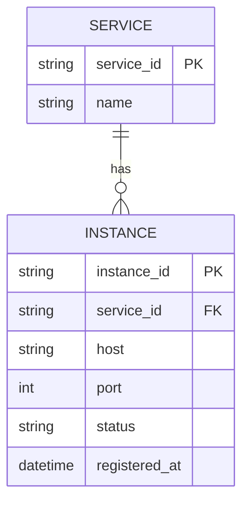

# ERD — Base (trước khi có registry với health check/cache/TTL đầy đủ)

Đây là **base**: mô hình dữ liệu suy luận cho nền tảng SaaS *trước khi* có các yêu cầu nâng cao về registry. Đề bài giả định đã có một registry trung tâm đơn giản và các service tự đăng ký/gọi lẫn nhau — nếu chưa có SERVICE/INSTANCE thì các yêu cầu về active/passive health check, TTL, cache phía client sẽ không có nghĩa. ERD base chưa có version, cache hay TTL.

