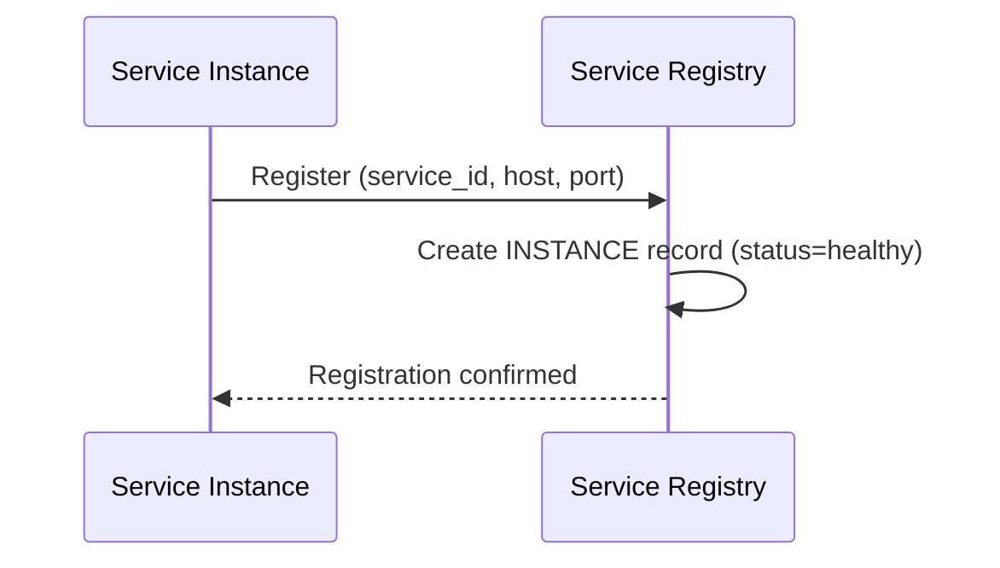

# Sequence Diagram — Base: Register Instance

Đây là **base**, flow một instance tự đăng ký khi khởi động — tiền đề bắt buộc để sau này bổ sung metadata version/zone, cơ chế deregister khi shutdown, và phát hiện crash qua TTL.

