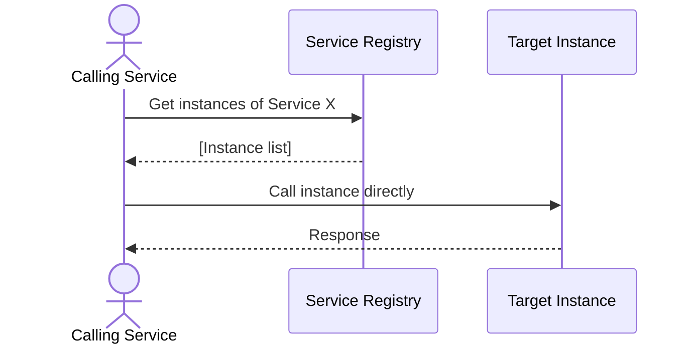

# Sequence Diagram — Base: Discover Instance

Đây là **base**, flow một service khác gọi thẳng tới registry mỗi lần cần biết danh sách instance — chưa có cache, chưa có cơ chế TTL/invalidate, đây chính là điểm sẽ thay đổi ở enhance.

