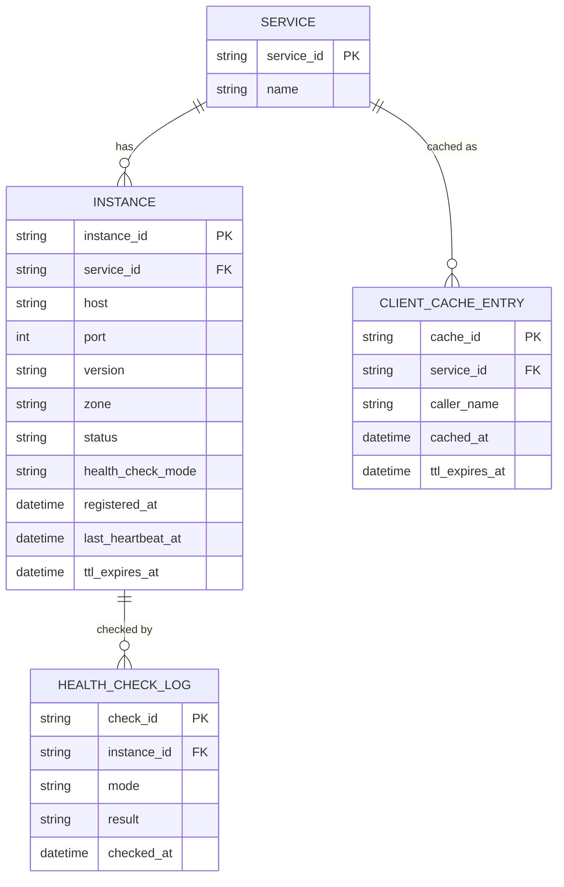

# ERD — Enhance (sau khi có health check/cache/TTL đầy đủ)

Đây là **enhance**: ERD base cộng với các entity phục vụ đúng yêu cầu đề bài — metadata version/zone khi đăng ký, active/passive health check log, TTL/heartbeat để phát hiện crash, và cache phía client với TTL/invalidate. So với base, `INSTANCE` nay có `version`, `zone`, `health_check_mode` và `ttl_expires_at` để registry tự loại instance chết mà không cần chờ deregister.

