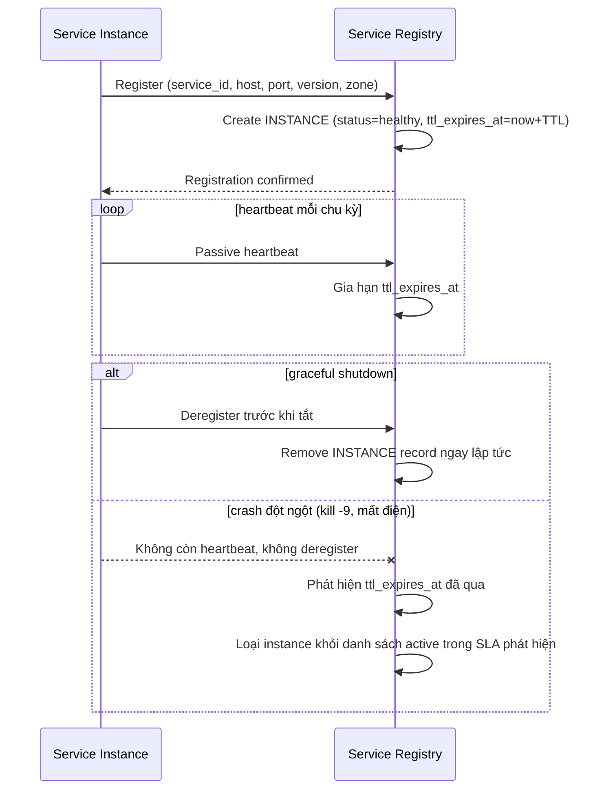

# Sequence Diagram — Enhance: Register Instance

Đây là **enhance**, flow đăng ký thay đổi so với base: instance nay gửi kèm version/zone, tự deregister khi nhận shutdown signal, và nếu crash không kịp deregister thì registry tự phát hiện qua TTL/heartbeat timeout trong SLA xác định (ví dụ dưới 30 giây) thay vì instance chết luôn nằm trong registry.

