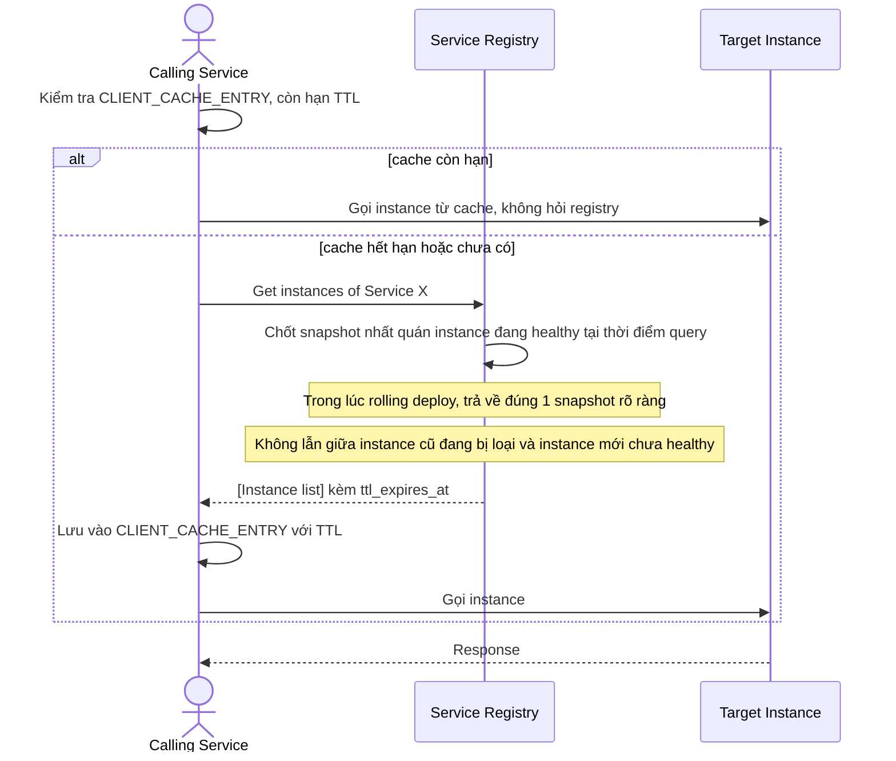

# Sequence Diagram — Enhance: Discover Instance

Đây là **enhance**, flow discover thay đổi so với base: caller nay dùng `CLIENT_CACHE_ENTRY` với TTL để giảm tải registry thay vì gọi trực tiếp mỗi lần, đồng thời trong lúc rolling deploy hai version cùng đăng ký gần như đồng thời thì caller vẫn phải nhận danh sách nhất quán, không bị lẫn instance cũ/mới gây lỗi.

