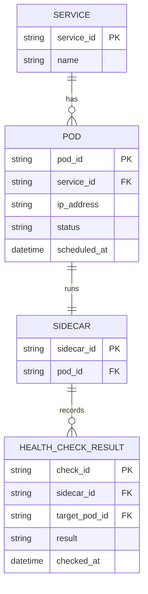

# ERD — Base (trước khi sidecar có liveness/readiness và fail-open cache)

Đây là **base**: mô hình dữ liệu suy luận cho nền tảng service mesh nội bộ *trước khi* có các yêu cầu nâng cao về sidecar. Đề bài giả định đã có control plane lưu danh sách service/pod, và mỗi pod có sidecar tự discover + health check đơn giản — nếu chưa có POD/SIDECAR/CONTROL_PLANE thì các yêu cầu về warm-up, fail-open, backoff sẽ không có nghĩa. ERD base chỉ có 1 loại health check chung chung.

