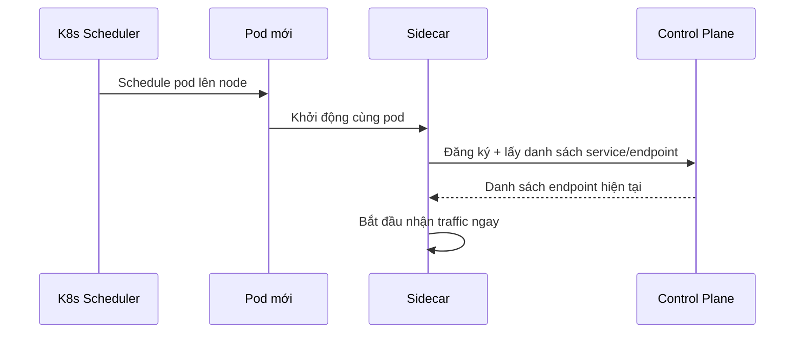

# Sequence Diagram — Base: Register Pod With Control Plane

Đây là **base**, flow pod mới được scheduler đưa lên, sidecar tự discover danh sách service khác qua control plane — tiền đề bắt buộc để sau này bổ sung cơ chế warm-up trước khi nhận traffic và cache khi control plane không phản hồi.

