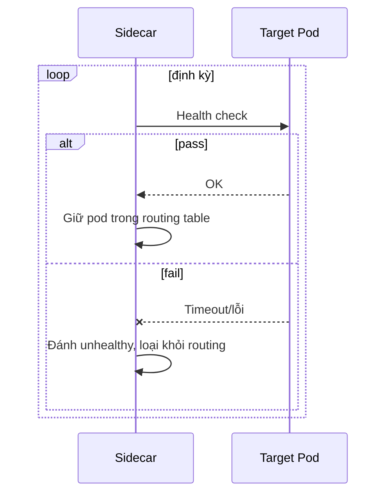

# Sequence Diagram — Base: Health Check And Route

Đây là **base**, flow sidecar health check các endpoint đang giao tiếp bằng một loại kiểm tra chung chung rồi loại pod lỗi khỏi routing — chưa phân biệt liveness/readiness, chưa có backoff, chưa báo rõ nguyên nhân lỗi. Đây chính là điểm sẽ thay đổi ở enhance.

