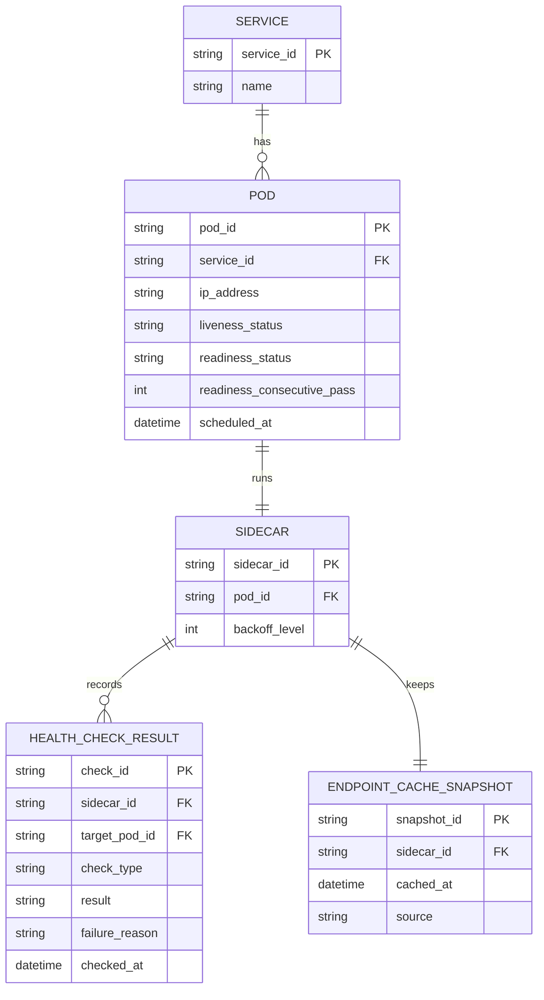

# ERD — Enhance (sau khi sidecar có liveness/readiness và fail-open cache)

Đây là **enhance**: ERD base cộng với các entity phục vụ đúng yêu cầu đề bài — tách liveness/readiness với nguyên nhân lỗi rõ ràng, đếm số lần readiness pass liên tiếp cho warm-up, backoff khi liên tục fail, và cache snapshot endpoint tại sidecar để fail-open khi mất control plane. So với base, `HEALTH_CHECK_RESULT` nay có `check_type` và `failure_reason` thay vì chỉ 1 kết quả chung.

