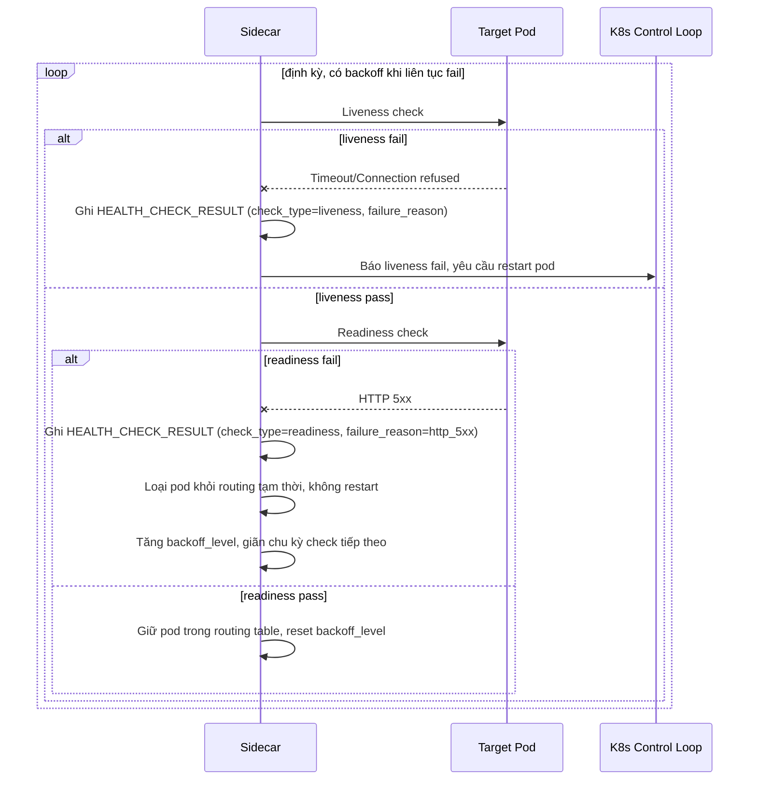

# Sequence Diagram — Enhance: Health Check And Route

Đây là **enhance**, flow health check thay đổi hẳn so với base: tách rõ liveness check (fail thì restart pod) và readiness check (fail thì chỉ loại khỏi routing tạm thời), có backoff khi liên tục fail để không tạo tải thêm lên service đang yếu, và ghi rõ `failure_reason` (timeout, HTTP 5xx, connection refused) thay vì chỉ trả unhealthy chung chung.

