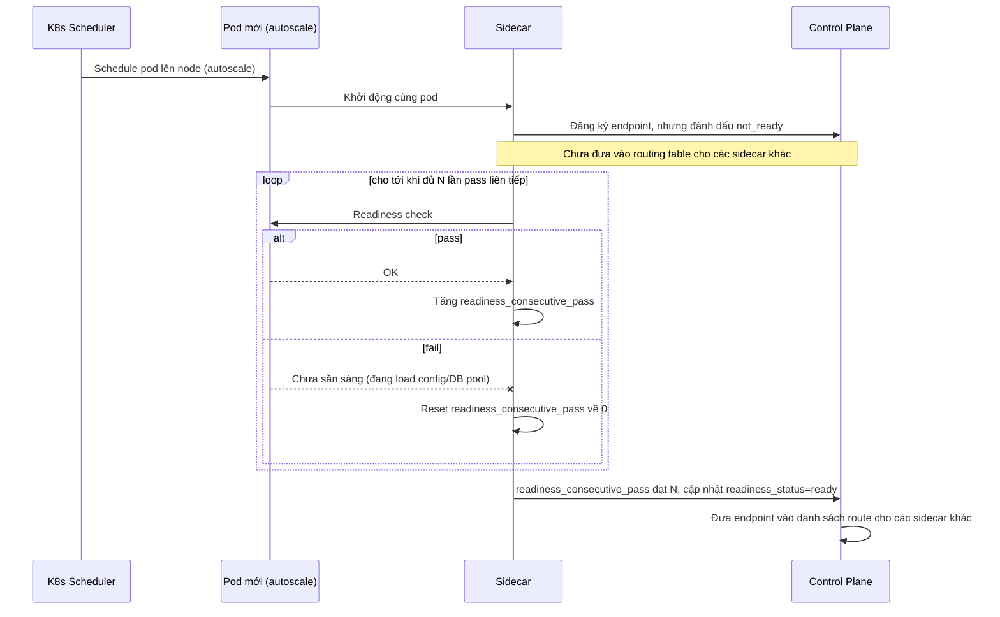

# Sequence Diagram — Enhance: Pod Warmup Readiness Gating

Đây là **enhance**, flow hoàn toàn mới cho pod vừa được scheduler đưa lên do autoscale — pod không được nhận traffic ngay như ở base, mà phải chờ readiness check pass ít nhất N lần liên tiếp để tránh nhận request trong lúc đang warm-up (load config, kết nối DB pool...).

