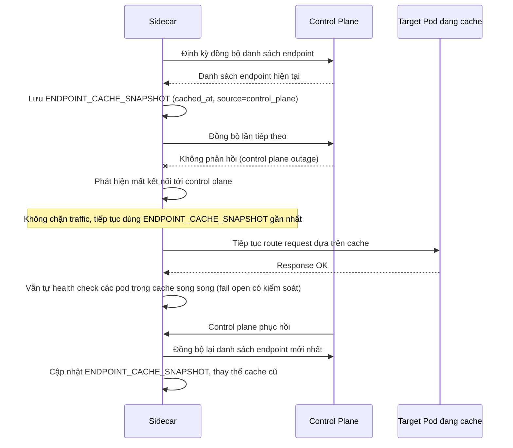

# Sequence Diagram — Enhance: Control Plane Outage Fallback

Đây là **enhance**, flow hoàn toàn mới xử lý khi control plane tạm thời không phản hồi — sidecar phải dùng `ENDPOINT_CACHE_SNAPSHOT` gần nhất để tiếp tục route traffic (fail open có kiểm soát), không được để toàn bộ traffic đứng lại chỉ vì mất kết nối tới control plane.

