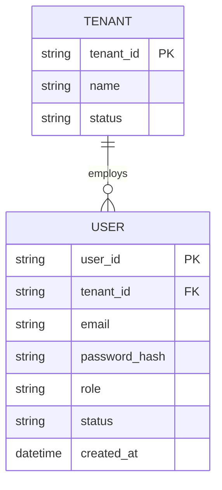

# ERD — Base (trước khi có SSO qua IdP của từng tenant)

Đây là **base**: mô hình dữ liệu suy luận cho SaaS quản lý dự án multi-tenant *trước khi* có yêu cầu tích hợp SSO. Đề bài giả định hệ thống đã có sẵn khái niệm tenant và user đăng nhập bằng email/password do admin tenant tự tạo — nếu chưa có TENANT/USER thì việc "mỗi tenant tự cấu hình SSO với IdP riêng" sẽ không có nghĩa. ERD base chưa có khái niệm IdP, JIT provisioning hay SCIM.

