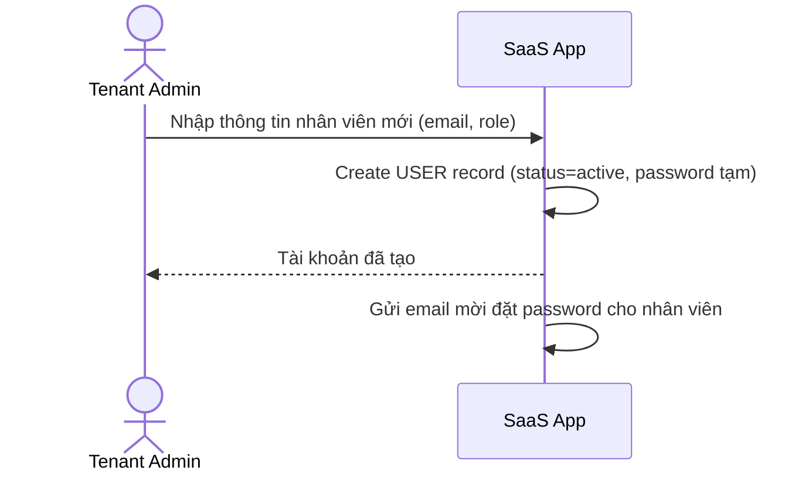

# Sequence Diagram — Base: Admin Creates User Manually

Đây là **base**, flow admin tenant tự tạo tài khoản nhân viên thủ công — tiền đề để so sánh với JIT provisioning ở enhance, nơi tài khoản được tự động tạo ngay lần đầu đăng nhập SSO thay vì admin phải tạo tay từng người.

