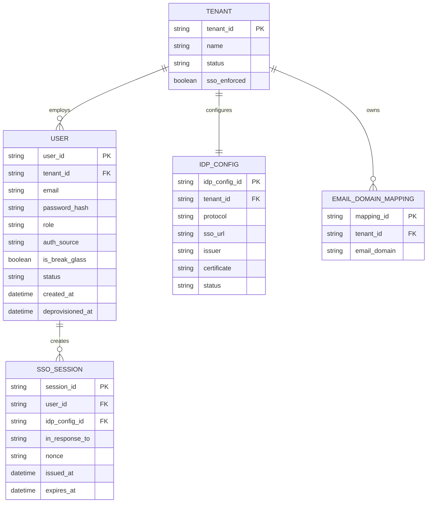

# ERD — Enhance (sau khi có SSO qua IdP của từng tenant)

Đây là **enhance**: ERD base cộng với các entity phục vụ đúng yêu cầu đề bài — cấu hình IdP trừu tượng hóa SAML/OIDC cho từng tenant, ánh xạ email domain sang tenant, phiên SSO chống replay, cờ break-glass, và JIT/SCIM provisioning. So với base, `USER` nay có `auth_source` và `is_break_glass`, còn việc tạo user không chỉ do admin tạo tay mà còn tự động qua SSO lần đầu.

