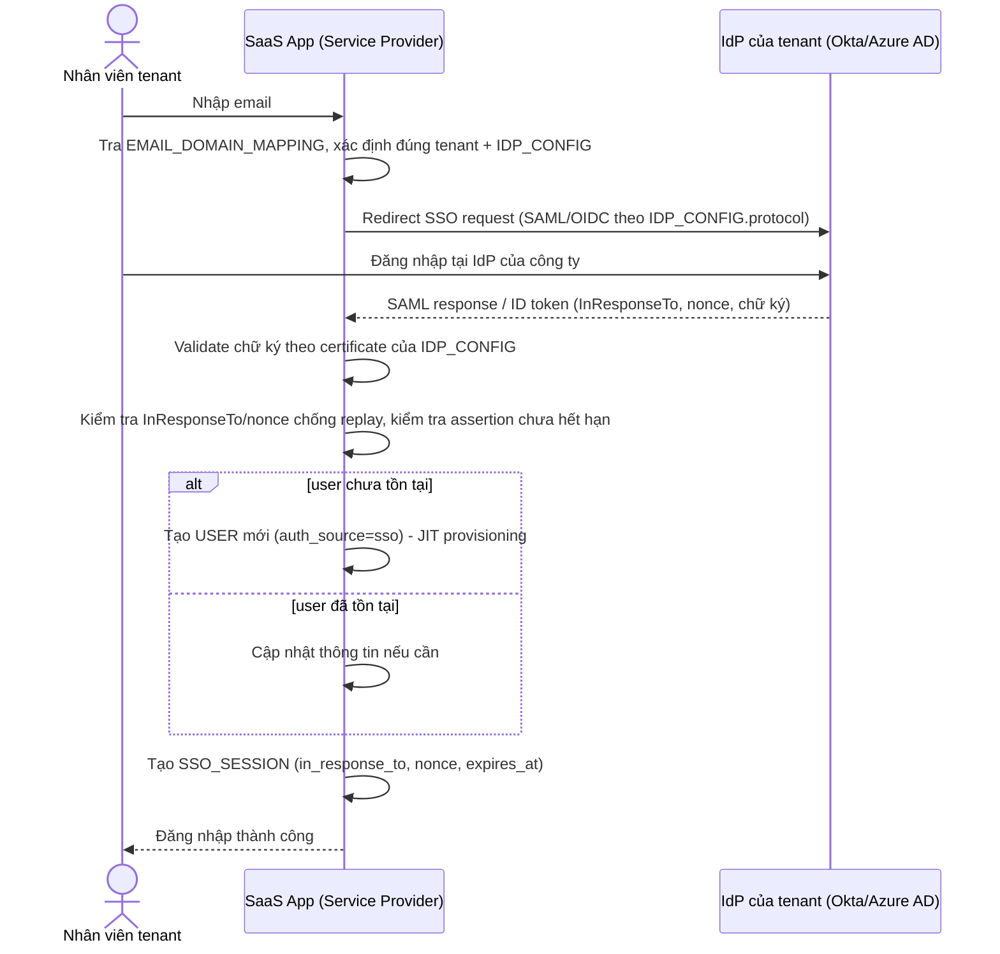

# Sequence Diagram — Enhance: SSO Login JIT Provisioning

Đây là **enhance**, flow hoàn toàn mới thay thế phần lớn base: user chỉ nhập email, hệ thống tra `EMAIL_DOMAIN_MAPPING` để biết redirect tới IdP nào, validate chữ ký/chống replay, rồi tự động tạo `USER` ngay lần đầu đăng nhập (JIT) thay vì admin phải tạo tay như flow "admin-creates-user-manually" ở base.

