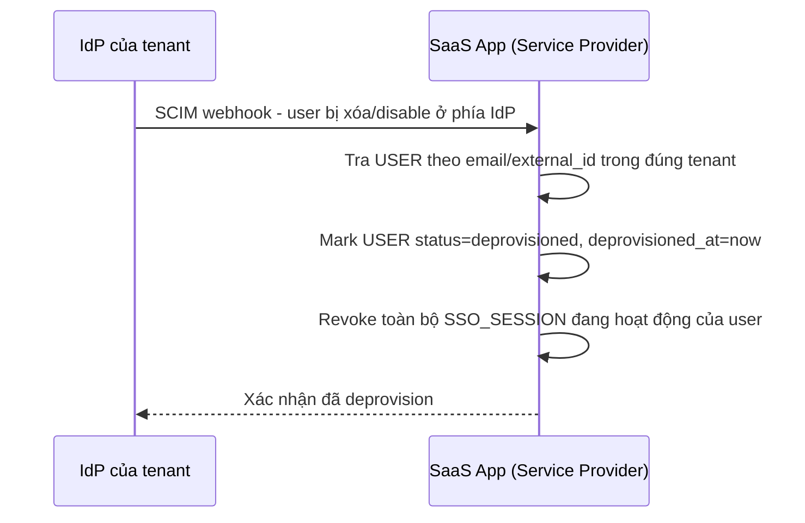

# Sequence Diagram — Enhance: SCIM Deprovision User

Đây là **enhance**, flow hoàn toàn mới xử lý khi IdP báo user bị xóa — hệ thống phải khóa/deprovision tài khoản tương ứng qua SCIM hoặc webhook, tránh tài khoản "mồ côi" còn quyền truy cập sau khi đã bị xóa ở phía IdP.

