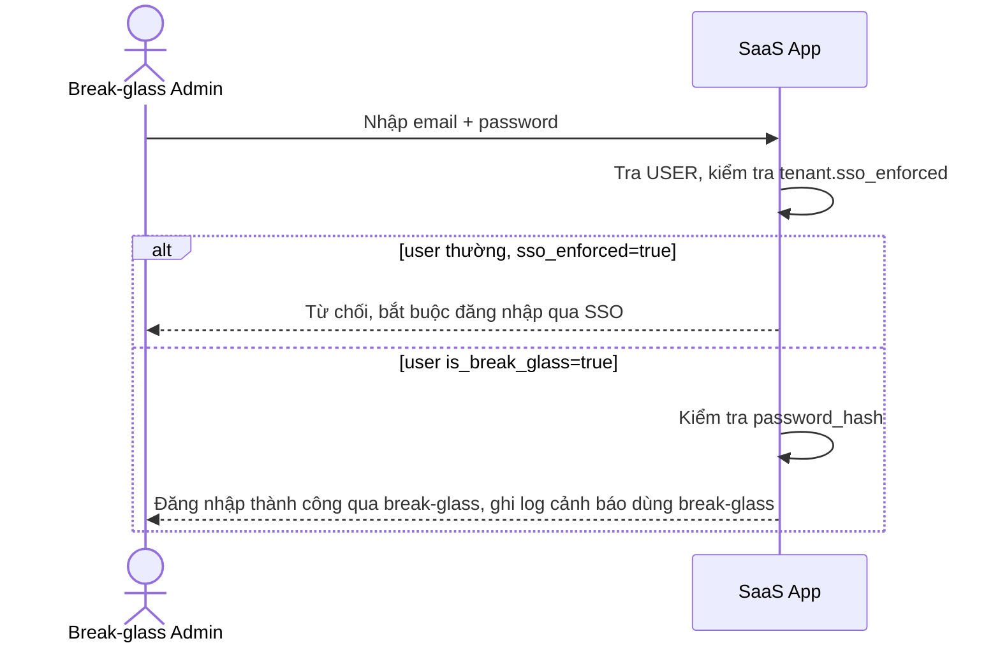

# Sequence Diagram — Enhance: Break-Glass Login

Đây là **enhance**, biến thể của flow "password-login" ở base nhưng nay bị giới hạn chỉ cho tài khoản `is_break_glass=true` sử dụng khi tenant đã bật `sso_enforced` — mọi user thường khác bị chặn đăng nhập bằng password và buộc phải qua SSO, phòng trường hợp IdP của tenant sập hoàn toàn.

