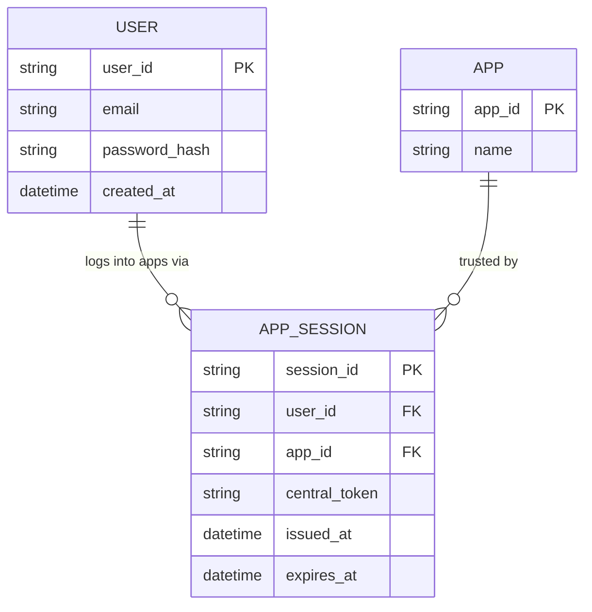

# ERD — Base (trước khi có phân quyền per-app, đồng bộ bảo mật, revoke theo phạm vi)

Đây là **base**: mô hình dữ liệu suy luận cho hệ sinh thái nhiều app tiêu dùng *trước khi* có các yêu cầu nâng cao. Đề bài mô tả nền tảng "đã tự làm Identity Provider trung tâm" — nghĩa là base đã có sẵn 1 danh tính người dùng dùng chung và các app con tin tưởng token trung tâm, nhưng chưa phân biệt quyền riêng từng app, chưa đồng bộ tín hiệu bảo mật, chưa tách ngữ cảnh cá nhân/tổ chức, chưa revoke theo phạm vi từng app.

