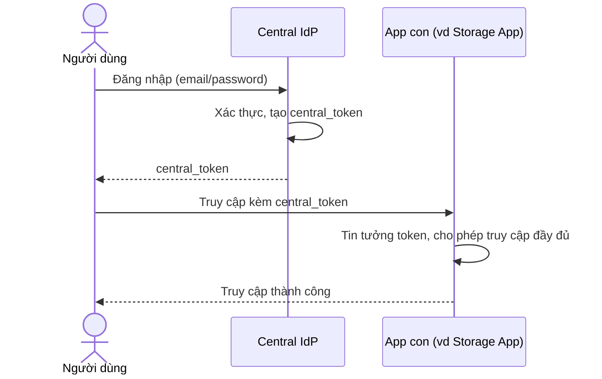

# Sequence Diagram — Base: Central SSO Login

Đây là **base**, flow đăng nhập một lần tại IdP trung tâm rồi mọi app con tin tưởng thẳng token trả về, không tự truy vấn quyền riêng — đây chính là điểm sẽ thay đổi ở enhance vì token không thể mang theo toàn bộ quyền của mọi app.

