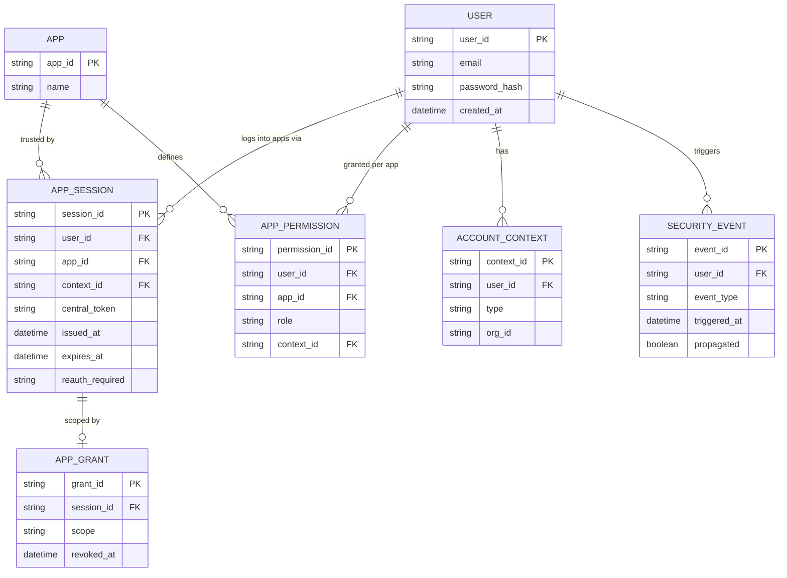

# ERD — Enhance (sau khi có phân quyền per-app, đồng bộ bảo mật, revoke theo phạm vi)

Đây là **enhance**: ERD base cộng với các entity phục vụ đúng yêu cầu đề bài — quyền riêng từng app tách khỏi token trung tâm, sự kiện bảo mật lan truyền để app yêu cầu re-auth, ngữ cảnh cá nhân/tổ chức, cache/fallback khi IdP quá tải, và revoke theo phạm vi từng app. So với base, `APP_SESSION` không còn tự mang toàn quyền mà mỗi app phải tự tra `APP_PERMISSION` sau khi xác thực.

