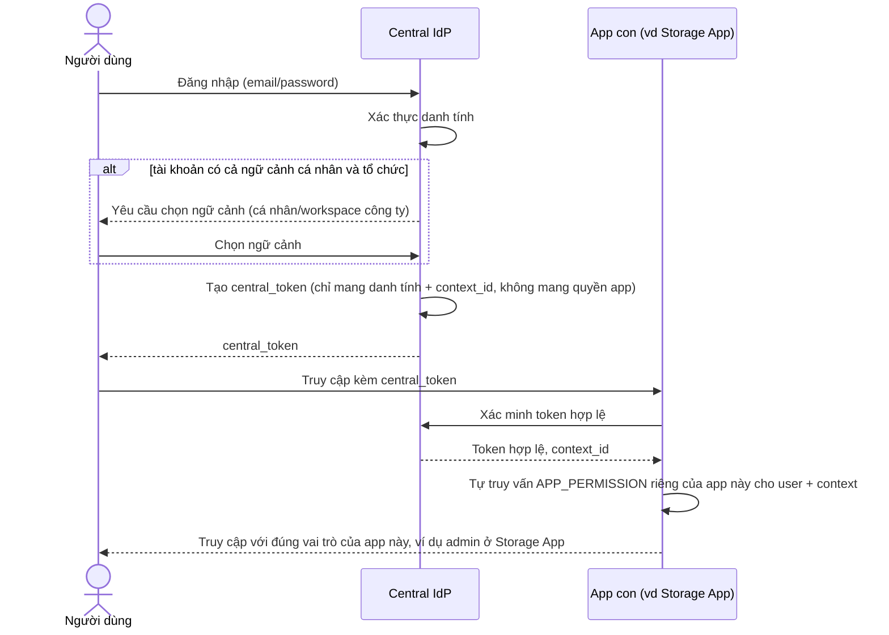

# Sequence Diagram — Enhance: Central SSO Login

Đây là **enhance**, flow login thay đổi so với base: sau khi IdP xác thực danh tính, mỗi app con tự truy vấn `APP_PERMISSION` riêng của mình thay vì tin token mang sẵn toàn quyền, đồng thời user phải chọn rõ ngữ cảnh cá nhân/tổ chức nếu tài khoản thuộc cả hai.

