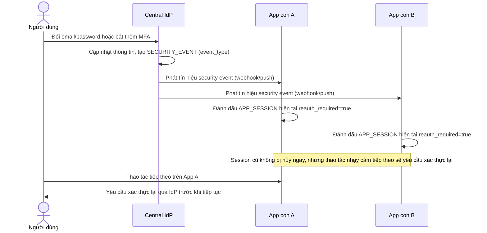

# Sequence Diagram — Enhance: Security Change Reauth Propagation

Đây là **enhance**, flow hoàn toàn mới: khi user đổi thông tin nhạy cảm ở tài khoản trung tâm, mọi app con đang có session hoạt động phải nhận tín hiệu để yêu cầu xác thực lại, tránh trường hợp kẻ tấn công chiếm tài khoản trung tâm vẫn dùng được session cũ ở app khác vô thời hạn.

