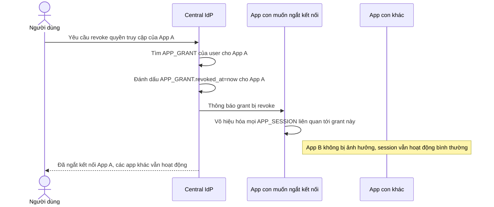

# Sequence Diagram — Enhance: Per-App Revoke

Đây là **enhance**, flow hoàn toàn mới cho phép user thu hồi quyền truy cập của một app cụ thể mà không ảnh hưởng các app khác trong hệ sinh thái, thông qua việc revoke `APP_GRANT` theo phạm vi thay vì đăng xuất toàn bộ hệ sinh thái.

