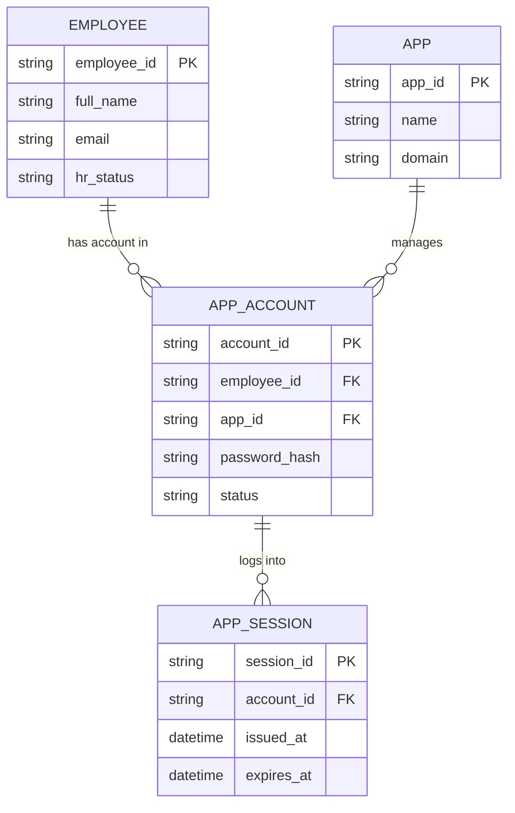

# ERD — Base (trước khi có cổng đăng nhập chung SSO nội bộ)

Đây là **base**: mô hình dữ liệu suy luận cho các app nội bộ doanh nghiệp *trước khi* có cổng đăng nhập chung. Đề bài nói rõ "mỗi app hiện có login riêng" — nghĩa là base đã có nhân viên (từ hệ thống HR) và mỗi app tự quản lý tài khoản/session cục bộ riêng biệt, chưa có IdP trung tâm, chưa chia sẻ session, chưa có Single Logout.

