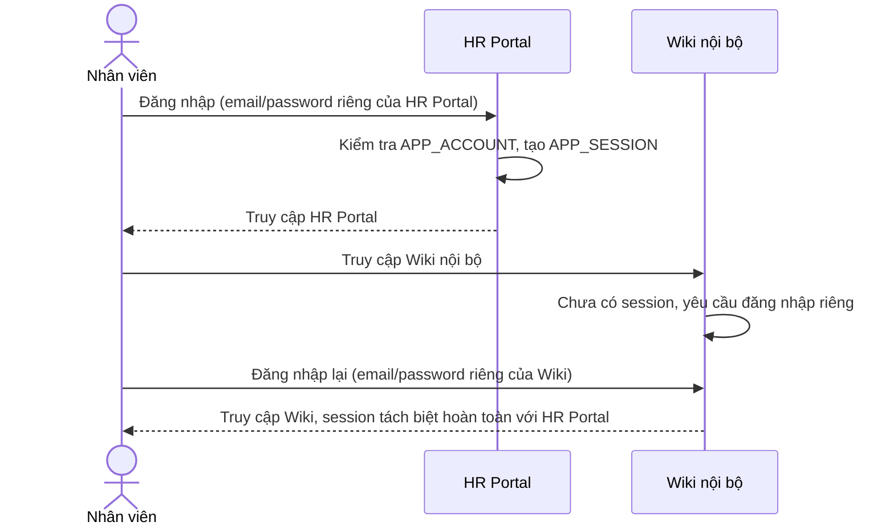

# Sequence Diagram — Base: App Login

Đây là **base**, flow nhân viên đăng nhập riêng lẻ vào từng app nội bộ với tài khoản/session cục bộ của app đó — tiền đề bắt buộc để enhance thay thế bằng luồng SSO tập trung, vì "đăng nhập một lần, truy cập mọi app" chỉ có nghĩa khi trước đó mỗi app đang login độc lập.

