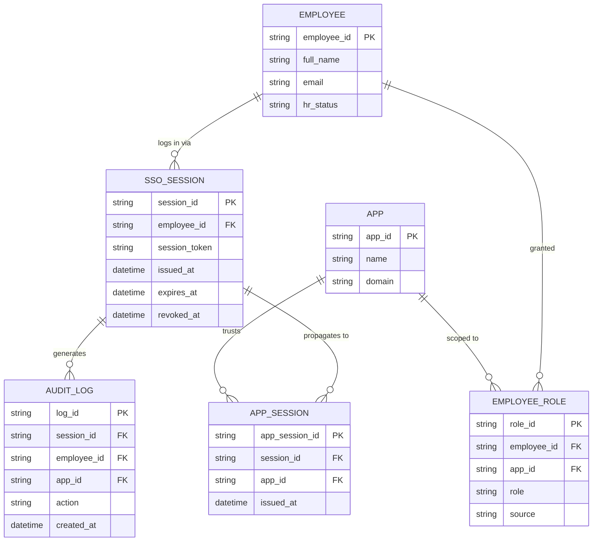

# ERD — Enhance (sau khi có cổng đăng nhập chung SSO nội bộ)

Đây là **enhance**: ERD base cộng với các entity phục vụ đúng yêu cầu đề bài — IdP trung tâm, session SSO chia sẻ giữa các subdomain/app kèm chống session fixation, Single Logout, role/group đồng bộ từ HR, và audit log tập trung. So với base, `APP_SESSION` không còn độc lập mà mọi app đều tham chiếu về 1 `SSO_SESSION` trung tâm duy nhất.

