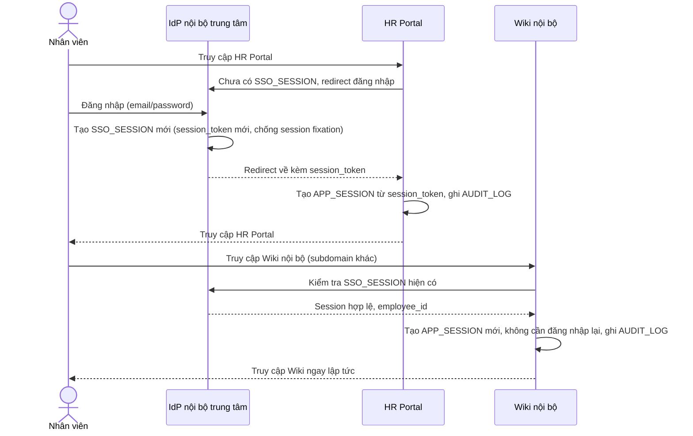

# Sequence Diagram — Enhance: App Login

Đây là **enhance**, flow app login thay đổi hoàn toàn so với base: nhân viên chỉ đăng nhập một lần tại IdP trung tâm để tạo `SSO_SESSION`, sau đó mọi app khác trên các subdomain khác nhau tự nhận `APP_SESSION` từ session trung tâm mà không cần đăng nhập lại, kèm cơ chế chống session fixation khi chuyển giữa các app.

