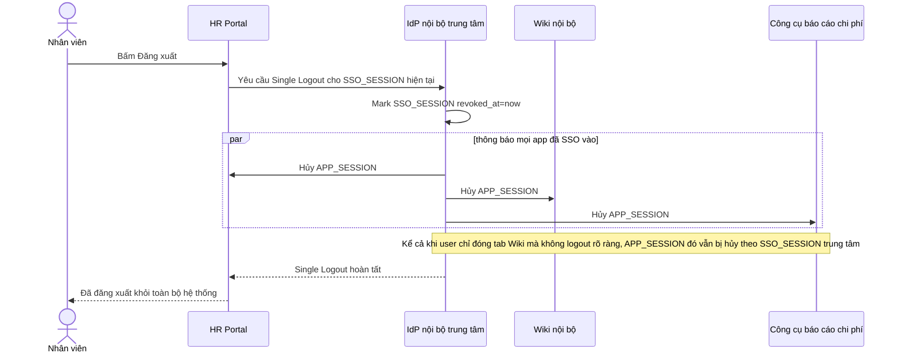

# Sequence Diagram — Enhance: Single Logout

Đây là **enhance**, flow hoàn toàn mới: đăng xuất ở một app phải đăng xuất khỏi toàn bộ app con đã SSO vào, kể cả khi user chỉ đóng tab mà không bấm logout rõ ràng — không thể tồn tại ở base vì base không có khái niệm session dùng chung.

