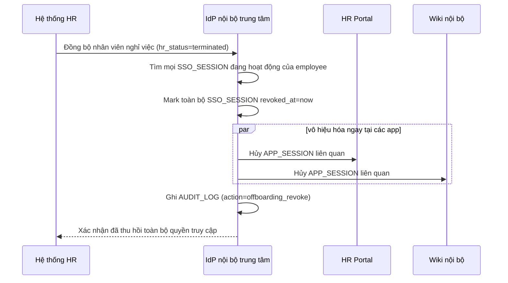

# Sequence Diagram — Enhance: Employee Offboarding Revoke

Đây là **enhance**, flow hoàn toàn mới: khi nhân viên nghỉ việc, revoke session ở IdP trung tâm phải làm mất quyền truy cập ở tất cả app con gần như ngay lập tức, không chờ từng app tự hết session như ở base.

