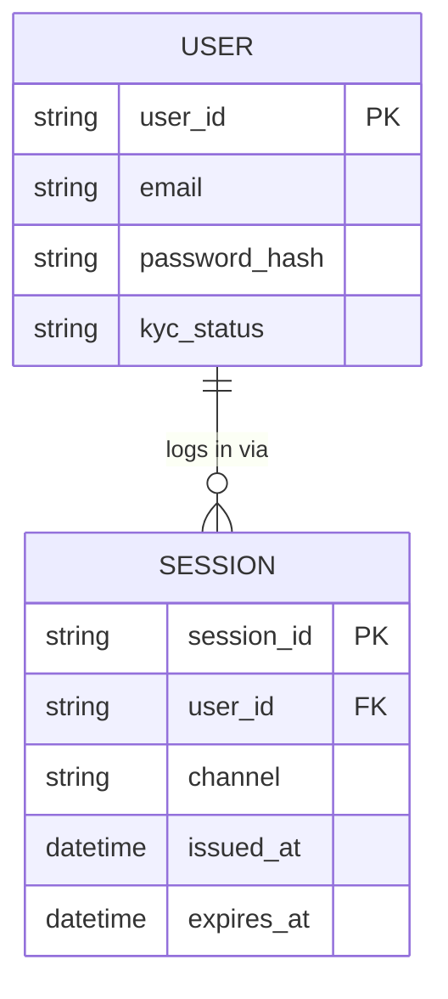

# ERD — Base (trước khi có SSO đồng bộ web/mobile và luồng nhúng đối tác)

Đây là **base**: mô hình dữ liệu suy luận cho nền tảng fintech *trước khi* có yêu cầu đồng bộ session và luồng nhúng đối tác. Đề bài giả định nền tảng đã có web app và mobile app riêng, mỗi kênh tự xác thực và tạo session độc lập, chưa đồng bộ trạng thái đăng nhập giữa hai kênh, chưa có khái niệm đối tác nhúng.

