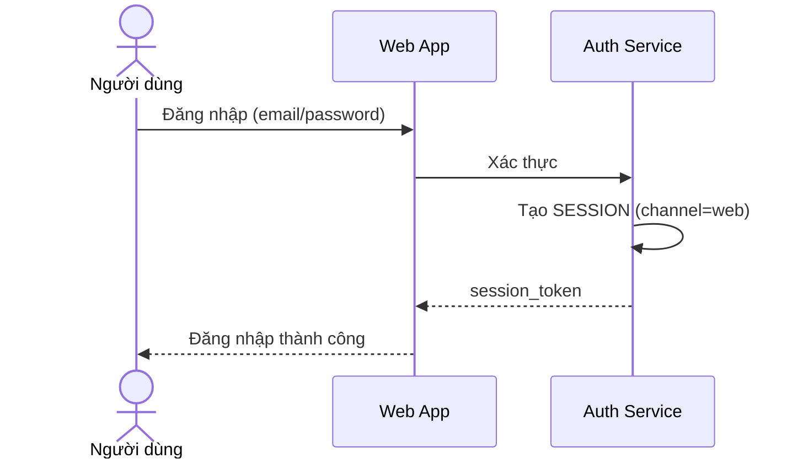

# Sequence Diagram — Base: Web Login

Đây là **base**, flow đăng nhập trên web app, tạo session độc lập với mobile — tiền đề để so sánh với enhance, nơi đăng xuất trên web phải phản ánh gần như ngay lập tức trên mobile qua token revocation thay vì hai kênh tách biệt hoàn toàn.

