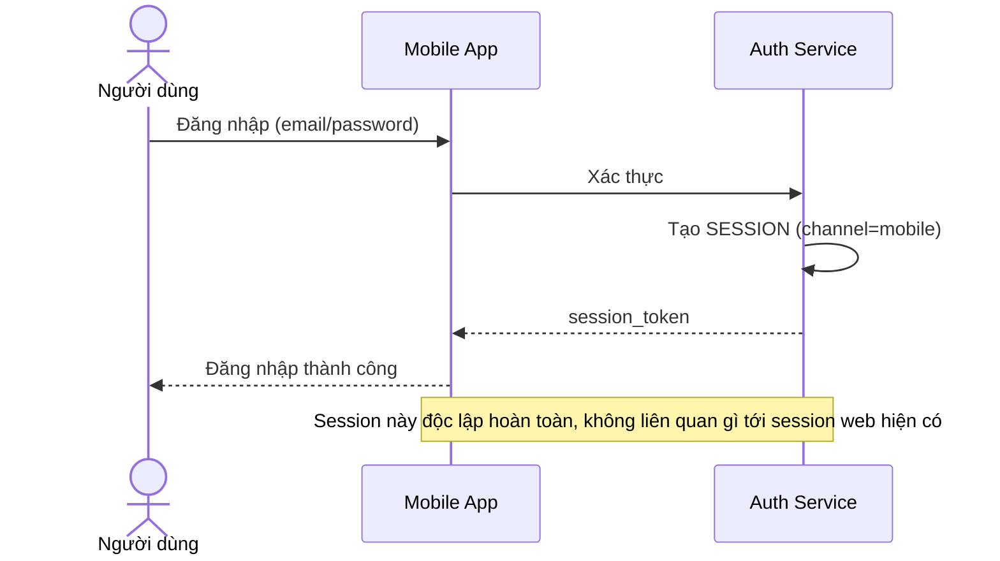

# Sequence Diagram — Base: Mobile Login

Đây là **base**, flow đăng nhập trên mobile app, hoàn toàn độc lập với session web — cùng với flow web-login, đây là tiền đề bắt buộc để enhance xây cơ chế đồng bộ trạng thái đăng nhập xuyên kênh.

