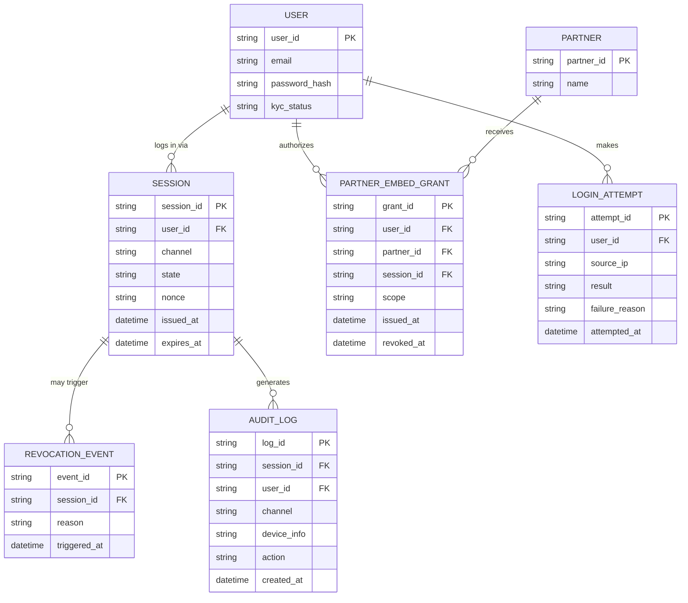

# ERD — Enhance (sau khi có SSO đồng bộ web/mobile và luồng nhúng đối tác)

Đây là **enhance**: ERD base cộng với các entity phục vụ đúng yêu cầu đề bài — liên kết session các kênh về cùng 1 `USER` để đồng bộ đăng xuất, đối tác nhúng với token phạm vi giới hạn, phát hiện brute-force/token theft, và audit log cho mọi phiên liên quan đến tiền. So với base, `SESSION` nay được nhóm theo `user_id` để Single Logout có thể huỷ đồng loạt mọi kênh, kể cả phiên nhúng ở đối tác.

