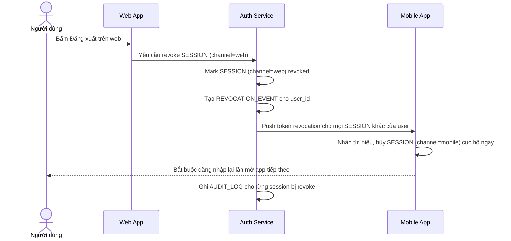

# Sequence Diagram — Enhance: Cross-Channel Logout Sync

Đây là **enhance**, flow hoàn toàn mới nối liền hai flow base "web-login" và "mobile-login": đăng xuất hoặc phát hiện bất thường trên một kênh giờ đây đẩy tín hiệu revoke qua push tới mọi kênh khác của cùng user gần như ngay lập tức, thay vì mỗi session tự sống độc lập tới khi hết hạn như ở base.

