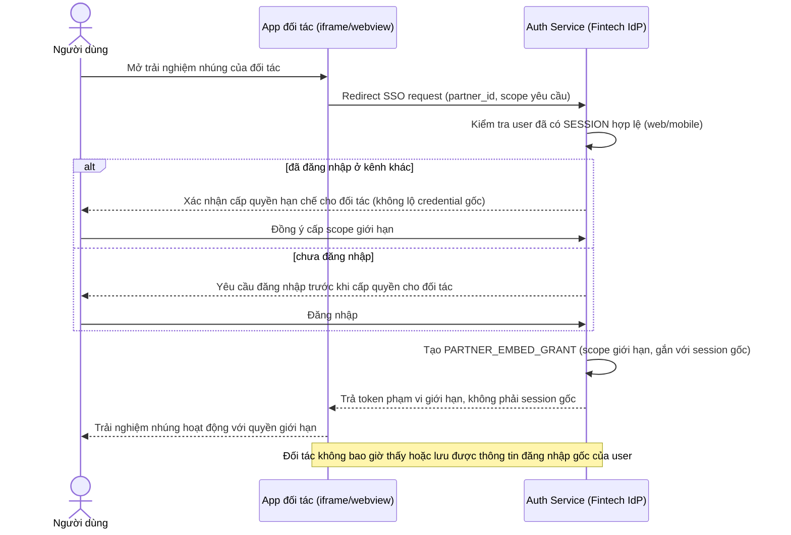

# Sequence Diagram — Enhance: Embedded Partner SSO

Đây là **enhance**, flow hoàn toàn mới cho đối tác nhúng qua iframe/webview: cấp một token phạm vi giới hạn (`PARTNER_EMBED_GRANT`), không cho đối tác thấy hoặc lưu thông tin đăng nhập gốc, và Single Logout phải kết thúc luôn phiên nhúng này khi user đăng xuất ở nơi khác.

