# Sequence Diagram — Enhance: Detect Brute Force SSO Attempt

Đây là **enhance**, flow hoàn toàn mới phát hiện và ngăn brute-force/token theft trong quá trình SSO — ví dụ nhiều lần thử với state/nonce sai từ cùng một IP — kèm ghi audit log đầy đủ vì đây là phiên liên quan tới tiền, đáp ứng yêu cầu compliance tài chính.

```mermaid
sequenceDiagram
    actor Attacker as Nguồn nghi vấn
    participant Auth as Auth Service
    participant Alert as Alert/Compliance

    loop nhiều lần trong thời gian ngắn
        Attacker->>Auth: SSO callback với state/nonce sai, cùng source_ip
        Auth->>Auth: Ghi LOGIN_ATTEMPT (result=failed, failure_reason=invalid_nonce)
        Auth-->>Attacker: Từ chối
    end

    Auth->>Auth: Đếm số LOGIN_ATTEMPT thất bại liên tiếp từ cùng source_ip trong cửa sổ thời gian
    alt vượt ngưỡng brute-force
        Auth->>Auth: Tạm khóa nguồn IP/tài khoản liên quan
        Auth->>Alert: Cảnh báo nghi ngờ brute-force/token theft
        Auth->>Auth: Ghi AUDIT_LOG đầy đủ (ai, kênh nào, thiết bị nào) để phục vụ compliance
    end
```

