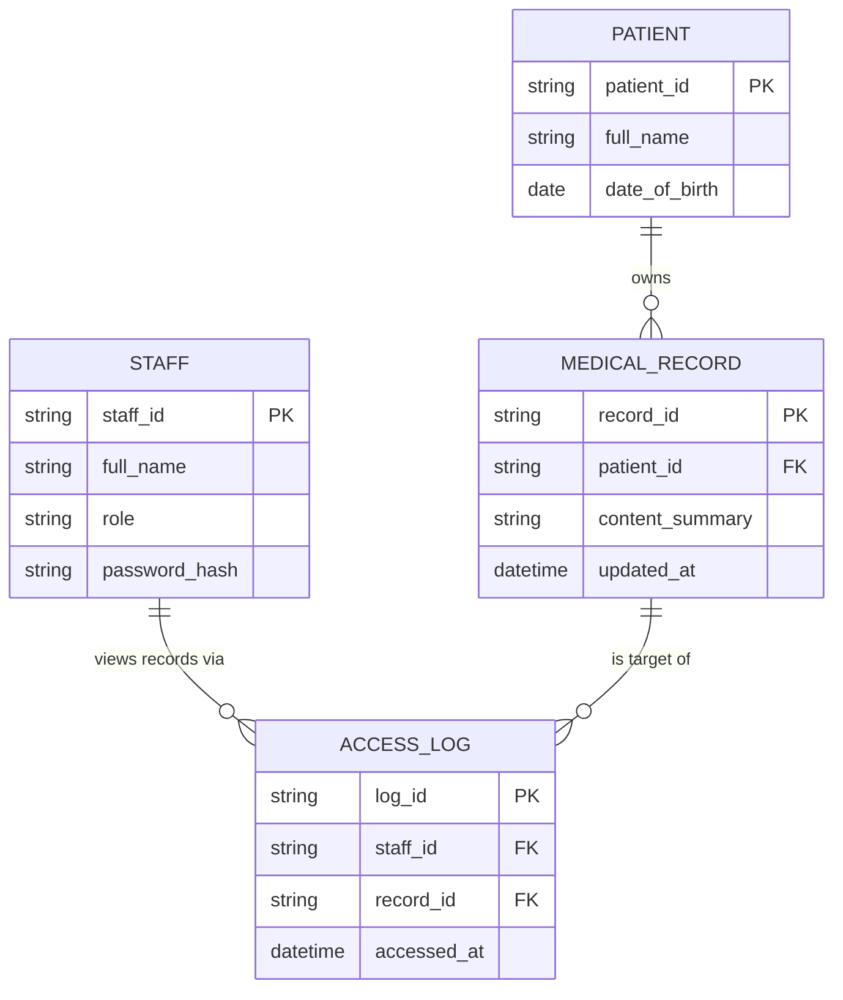

# ERD — Base (trước khi có SSO cho mạng lưới phòng khám liên kết)

Đây là **base**: mô hình dữ liệu suy luận cho hệ thống bệnh viện trung tâm *trước khi* mở SSO cho phòng khám liên kết. Đề bài giả định bệnh viện trung tâm đã có sẵn hệ thống hồ sơ bệnh án (EHR) với nhân viên y tế nội bộ và access log cơ bản khi xem hồ sơ — nếu chưa có STAFF/PATIENT/MEDICAL_RECORD thì việc "cho phép phòng khám liên kết SSO vào" sẽ không có nghĩa. Base chưa có khái niệm CLINIC, quan hệ điều trị, hay audit chi tiết theo từng lượt xem.

