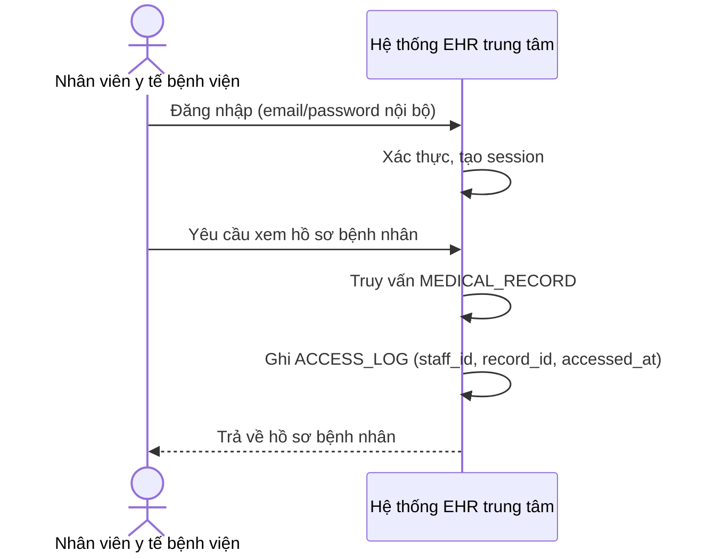

# Sequence Diagram — Base: Hospital Staff View Record

Đây là **base**, flow nhân viên y tế nội bộ bệnh viện đăng nhập và xem hồ sơ bệnh án với access log cơ bản — tiền đề bắt buộc vì enhance sẽ mở rộng đúng cơ chế xác thực và ghi log này cho nhân viên phòng khám liên kết, nhưng có thêm ràng buộc phạm vi và chi tiết hơn.

