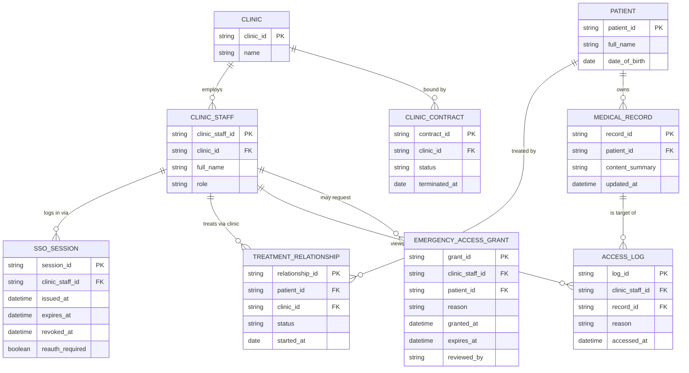

# ERD — Enhance (sau khi có SSO cho mạng lưới phòng khám liên kết)

Đây là **enhance**: ERD base cộng với các entity phục vụ đúng yêu cầu đề bài — phòng khám liên kết và nhân viên của họ, quan hệ điều trị giới hạn phạm vi xem hồ sơ, session SSO ngắn hạn cho nhân viên y tế, audit log chi tiết theo từng lượt xem, hợp đồng phòng khám để revoke đồng loạt, và luồng truy cập khẩn cấp có kiểm soát. So với base, `ACCESS_LOG` nay bắt buộc gắn với danh tính nhân viên cụ thể và lý do truy cập, còn quyền xem hồ sơ không còn "SSO xong là xem được tất cả" mà bị giới hạn bởi `TREATMENT_RELATIONSHIP`.

