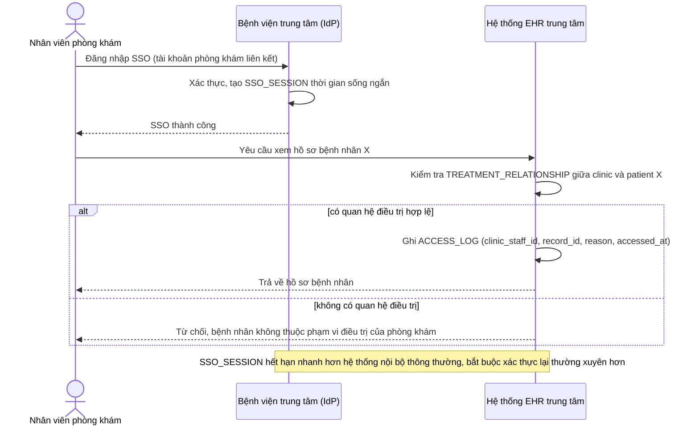

# Sequence Diagram — Enhance: Clinic Staff SSO Scoped Access

Đây là **enhance**, flow hoàn toàn mới cho nhân viên phòng khám liên kết — mở rộng nguyên lý xác thực + ghi log của flow base "hospital-staff-view-record" nhưng thêm ràng buộc phạm vi theo `TREATMENT_RELATIONSHIP` và session ngắn hạn bắt buộc xác thực lại thường xuyên, phù hợp với máy trạm dùng chung nhiều ca kíp.

