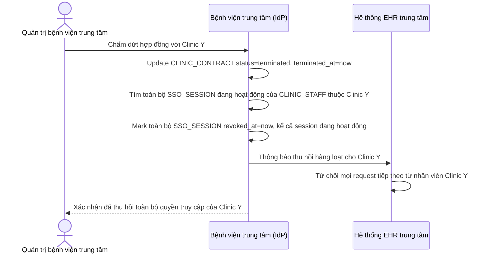

# Sequence Diagram — Enhance: Clinic Contract Termination Revoke

Đây là **enhance**, flow hoàn toàn mới: khi phòng khám liên kết chấm dứt hợp đồng, toàn bộ quyền SSO của nhân viên phòng khám đó phải bị thu hồi ngay lập tức và đồng loạt, kể cả nhân viên đang có session hoạt động, tránh truy cập trái phép sau khi quan hệ đã chấm dứt.

