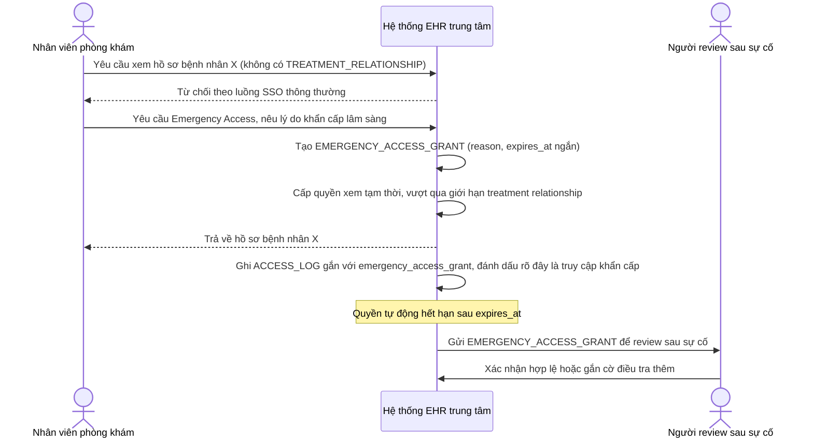

# Sequence Diagram — Enhance: Emergency Break-Glass Access

Đây là **enhance**, flow hoàn toàn mới cho tình huống khẩn cấp lâm sàng (ví dụ bệnh nhân chuyển viện gấp) — cấp quyền truy cập mở rộng có kiểm soát và giới hạn thời gian, tách biệt khỏi luồng SSO thông thường bị giới hạn bởi `TREATMENT_RELATIONSHIP`, và luôn kèm log để review sau.

