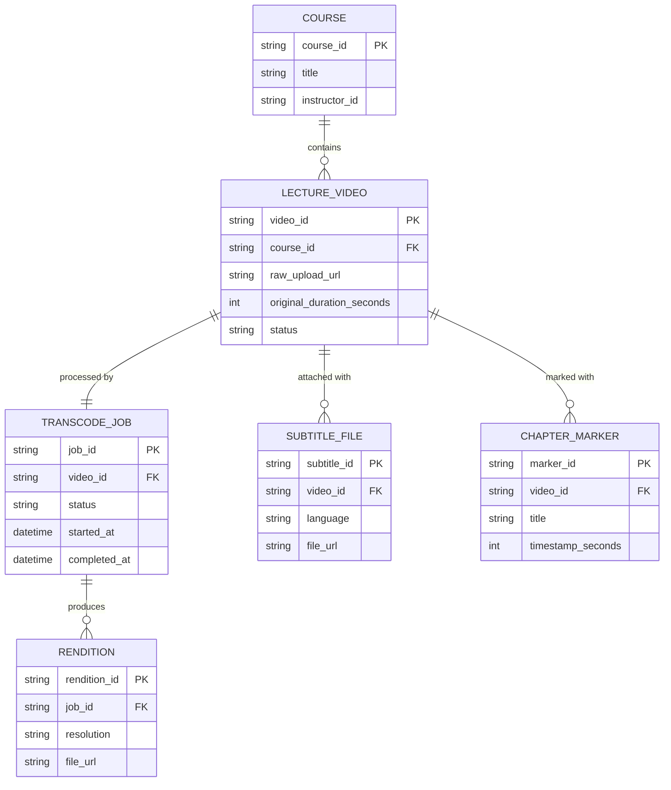

# ERD — Base (trước khi đồng bộ timestamp phụ đề/chapter qua pipeline)

Đây là **base**: mô hình dữ liệu suy luận cho nền tảng e-learning *trước khi* có yêu cầu đồng bộ timestamp qua nhiều bước transcode. Đề bài giả định nền tảng đã có video bài giảng, transcode ra nhiều độ phân giải, và giảng viên đã có thể gắn phụ đề/chapter marker — nếu chưa có các entity này thì việc "timestamp bị lệch sau khi qua pipeline" sẽ không có nghĩa. Ở base, quá trình transcode chỉ là 1 bước đơn giản, và timestamp phụ đề/chapter được giữ nguyên số giây gốc, không tính lại (đây chính là nguồn gốc gây lệch mà enhance phải xử lý). Giả định dữ liệu lưu quan hệ 1-nhiều đơn giản (SQL), phù hợp quy mô 1 platform e-learning.

