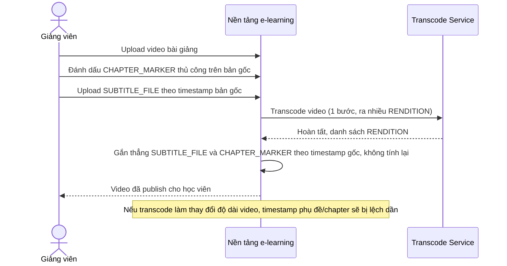

# Sequence Diagram — Base: Upload And Transcode Video

Đây là **base**, flow giảng viên upload video, hệ thống transcode 1 bước ra nhiều độ phân giải, phụ đề/chapter marker được gắn thẳng theo timestamp gốc mà không tính toán lại — đây chính là quy trình sẽ được thay đổi ở enhance vì mốc thời gian bị lệch khi transcode làm thay đổi độ dài video.

